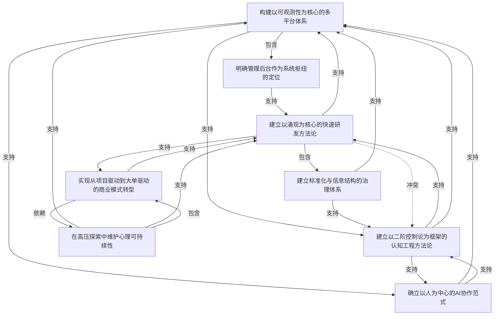

# 任务 1.3 输出：意图关系建模

## 意图关系图

---

## 元意图分析

有 3 个意图处于关系图的中心位置，辐射范围最广：

| 元意图 | 辐射范围 | 角色 |
|--------|---------|------|
| I3 建立以二阶控制论为框架的认知工程方法论 | I7, I8, I1 | 理论核心——理解一切工作的认知框架 |
| I8 建立以涌现为核心的快速研发方法论 | I5, I1, I4 | 方法核心——执行一切工作的方式 |
| I6 在高压探索中维护心理可持续性 | I1, I8, I4 | 基础核心——一切产出的前提条件 |

I3 和 I8 之间存在张力（结构化收敛 vs 快速涌现），但同时相互支持——二阶控制论的"观察-收敛"为涌现提供了方向，涌现为二阶控制论的认知收敛提供了素材。

---

## 冲突分析

### 冲突一：I3 二阶控制论 vs I8 涌现方法论（弱冲突）

**冲突本质**：结构化收敛 vs 快速试错的节奏矛盾。

**具体表现**：
- 二阶控制论追求"观察-收敛-控制规则"——要求先理解系统再干预，本质是认知先行
- 涌现方法论追求"表达-重构-发现模式"——要求先做再看，本质是行动先行
- 在精力有限的情况下，投入时间做认知工程（I3）就意味着少跑几个涌现式实验（I8），反之亦然

**解决线索**：日志中提到的"意图识别"（05-06）可能是连接两者的桥梁——涌现实验产生了碎片，二阶控制论帮助将这些碎片收敛为认知结构。二者形成"涌现发散 → 认知收敛 → 再涌现"的循环。

---

### 冲突二：I4 大单战略 vs I6 心理可持续性（隐性冲突）

**冲突本质**：大单战略的压力可能侵蚀心理可持续性。

**具体表现**：
- I4 要求"敢于做大的、接10万以上的单"，需要冒险精神和高压力承受力
- I6 要求"觉察压力、休息、释放情绪"，本质是降低压力
- 05-07 同时记录了"希望这一单顺利拿下"的期待和"压力好大超想谈恋爱"的崩溃
- I4 依赖 I6（高强度商业活动需要良好状态），但 I4 的执行行为可能破坏 I6 的维持

**解决线索**：日志中提到的"秘书处分单模式"——大单拆成小单交予团队，创始人从执行层回退到观察层，既满足 I4 的大单目标，又减少 I6 的个人压力。

---

## 逐意图关系详情

### I1 构建以可观测性为核心的多平台体系

**关联意图**：

| 关系类型 | 关联意图 | 强度 | 说明 |
|---------|---------|------|------|
| 包含 | I2 明确管理后台作为系统枢纽的定位 | 强 | 管理后台是多平台体系的子模块 |
| 支持 | I3 建立认知工程方法论 | 中 | 可观测性理念与二阶控制论同源 |
| 支持 | I7 确立AI协作范式 | 中 | 平台入口聊天化是AI协作的载体 |
| 依赖 | I5 标准化治理体系 | 中 | 平台体系需要标准化支撑 |
| 依赖 | I6 心理可持续性 | 中 | 平台构建压力需要心理调适 |

---

### I2 明确管理后台作为系统枢纽的定位

**关联意图**：

| 关系类型 | 关联意图 | 强度 | 说明 |
|---------|---------|------|------|
| 支持 | I8 涌现方法论 | 强 | 枢纽定位本身就是涌现方法的直接产物 |
| 依赖 | I1 多平台体系 | 强 | 枢纽的前提是多平台的存在 |

---

### I3 建立以二阶控制论为框架的认知工程方法论

**关联意图**：

| 关系类型 | 关联意图 | 强度 | 说明 |
|---------|---------|------|------|
| 支持 | I7 确立AI协作范式 | 强 | 二阶控制论指导AI如何理解人类意图 |
| 支持 | I8 涌现方法论 | 强 | 认知方法论指导探索的方向 |
| 支持 | I1 多平台体系 | 中 | 认知收敛为平台设计提供依据 |
| 冲突 | I8 涌现方法论 | 弱 | 结构化收敛 vs 快速试错的张力 |
| 依赖 | I7 确立AI协作范式 | 中 | AI是认知工程的工具和载体 |

---

### I4 实现从项目驱动到大单驱动的商业模式转型

**关联意图**：

| 关系类型 | 关联意图 | 强度 | 说明 |
|---------|---------|------|------|
| 依赖 | I6 维护心理可持续性 | 强 | 大单战略的高压力需要心理调适支撑 |
| 支持 | I8 涌现方法论 | 强 | 商业模式探索本身就是商业领域的涌现实验 |
| 依赖 | I8 涌现方法论 | 中 | 大单策略需要在探索中验证 |

---

### I5 建立标准化与信息结构的治理体系

**关联意图**：

| 关系类型 | 关联意图 | 强度 | 说明 |
|---------|---------|------|------|
| 支持 | I1 多平台体系 | 强 | 标准化支撑平台体系的可维护性 |
| 支持 | I3 认知工程方法论 | 中 | 概念统一是认知工程的基础设施 |

---

### I6 在高压探索中维护心理可持续性

**关联意图**：

| 关系类型 | 关联意图 | 强度 | 说明 |
|---------|---------|------|------|
| 支持 | I1 多平台体系 | 中 | 良好状态保障平台构建质量 |
| 支持 | I8 涌现方法论 | 中 | 精力管理支撑持续探索 |
| 包含 | I4 商业模式转型 | 弱 | 心理调适是商业探索的隐性子维度 |

---

### I7 确立以人为中心的AI协作范式

**关联意图**：

| 关系类型 | 关联意图 | 强度 | 说明 |
|---------|---------|------|------|
| 支持 | I1 多平台体系 | 强 | AI协作范式直接影响平台交互设计 |
| 支持 | I3 认知工程方法论 | 强 | AI协作是认知工程的工具和实现层 |
| 依赖 | I3 认知工程方法论 | 中 | AI协作需要二阶控制论的指导 |

---

### I8 建立以涌现为核心的快速研发方法论

**关联意图**：

| 关系类型 | 关联意图 | 强度 | 说明 |
|---------|---------|------|------|
| 包含 | I5 标准化与信息结构治理 | 中 | 标准化是涌现过程的自然沉淀产物 |
| 支持 | I1 多平台体系 | 强 | 涌现方法论推动平台建设的速度 |
| 支持 | I4 商业模式转型 | 强 | 快速验证方法论支撑商业探索 |
| 冲突 | I3 认知工程方法论 | 弱 | 先行动后收敛 vs 先理解后行动 |
| 依赖 | I6 心理可持续性 | 中 | 持续的涌现实验需要良好精力管理 |

---

## 关系统计

| 关系类型 | 数量 |
|---------|------|
| 支持（supports） | 14 |
| 包含（contains） | 4 |
| 演进（evolves） | 0 |
| 冲突（conflicts） | 2 |
| 依赖（depends on） | 6 |

**发现**：整个意图网络以"支持"和"依赖"关系为主。核心三角（I3 认知工程 × I8 涌现方法论 × I6 心理可持续性）构成了"理论-方法-基础"的自洽结构。冲突仅出现在 I3/I8 和 I4/I6 之间，且均为弱冲突，系统整体协调性良好。
