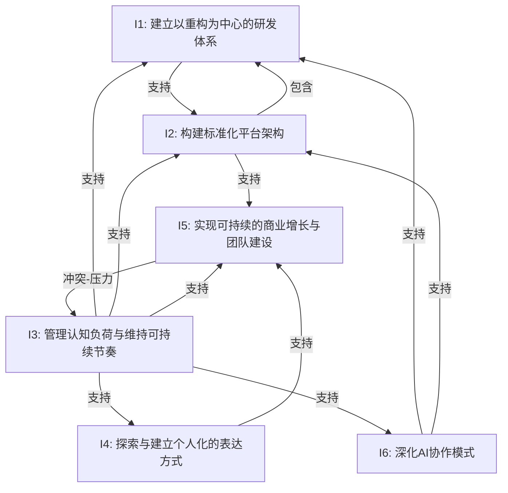

## 意图关系图



### 关系说明

| 关系类型 | 源意图 | 目标意图 | 说明 |
|----------|--------|----------|------|
| 支持 | I3（认知管理） | I1（研发体系） | 只有认知状态可控时才能持续执行重构循环 |
| 支持 | I3（认知管理） | I2（平台架构） | 架构设计是高认知负荷活动，需要良好状态 |
| 支持 | I3（认知管理） | I4（表达方式） | 创作需要心理安全和表达勇气 |
| 支持 | I3（认知管理） | I5（商业增长） | 管理团队和承受压力需要稳定的心理状态 |
| 支持 | I3（认知管理） | I6（AI协作） | 探索新的协作模式需要精力余裕 |
| 支持 | I6（AI协作） | I1（研发体系） | AI使重构循环加速、重构成本降低 |
| 支持 | I6（AI协作） | I2（平台架构） | AI辅助设计使标准化过程更流畅 |
| 支持 | I1（研发体系） | I2（平台架构） | 重构的产出是更干净的架构和标准 |
| 支持 | I2（平台架构） | I5（商业增长） | 平台标准化降低团队管理成本、提升交付能力 |
| 支持 | I4（表达方式） | I5（商业增长） | 表达力直接影响获客和品牌建设 |
| 冲突 | I5（商业增长） | I3（认知管理） | 营收压力和团队问题消耗认知资源，形成压力循环 |
| 包含 | I2（平台架构） | I1（研发体系） | 研发体系是平台架构的组成部分，平台为研发提供框架 |

## 元意图分析

### 元意图：从混乱到有序的系统化建构

本周所有六个意图共同指向一个更深层的元意图：**将创始人面临的多维混乱（代码混乱、架构混乱、认知混乱、商业混乱、表达混乱）通过系统化的方式转化为有序结构**。

**元意图的体现**：
- **I1（研发体系）** 将代码层面的混乱通过重构循环有序化
- **I2（平台架构）** 将系统层面的混乱通过标准化有序化
- **I3（认知管理）** 将内心层面的混乱通过觉察和调节有序化
- **I4（表达方式）** 将表达层面的混乱通过"非评判"和整合入口有序化
- **I5（商业增长）** 将组织和市场层面的混乱通过制度和平台有序化
- **I6（AI协作）** 将人机协作层面的混乱通过双引擎架构有序化

**元意图的演进轨迹**（按周内时间）：
```
05-11/12: 发现混乱（工作量、架构、商业）
     ↓
05-13:  命名混乱（疲惫、烦恼、不敢说）
     ↓
05-14:  建构系统（标准化、分层、状态依赖）
     ↓
05-15:  整理结构（第二大脑重构、九宫格定稿）
     ↓
05-16:  整合入口（小说、Vibe Coding检验）
     ↓
05-17:  升维抽象（人类认知瓶颈、system one/two）
```

### 关键冲突与张力

| 张力对 | 表现 | 本周处理方式 |
|--------|------|-------------|
| I5（商业压力）↔ I3（认知消耗） | 营收压力导致焦虑，焦虑降低工作效率 | 05-14接受"情绪隔离"，05-16承认"不敢说"并尝试打破 |
| 广度探索 ↔ 深度收敛 | 想尝试视频/小说/逆向/安全等多个方向 vs 需要聚焦平台构建 | 05-17提出"探索→生产"分离，用双云分拆解决 |
| 独立性 ↔ 团队依赖 | "一个人效率最高" vs "无法永远一个人做" | 05-14开始招聘+建立制度，05-17测试团队反应链条 |
