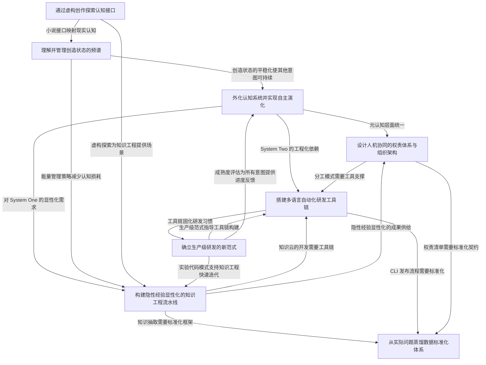

## Mermaid 关系图

## 元意图分析

本周 8 个意图可归为三个层次：

**认知层**（做什么、为什么做）
- I1 外化认知系统（元认知核心）
- I6 管理创造状态（能量基础）
- I7 虚构创作探索（认知平行通道）

**工程层**（怎么做）
- I2 知识工程流水线（核心产出线）
- I3 研发工具链（核心支撑线）
- I5 数据标准化（核心基础设施）

**组织层**（谁来做、怎么管）
- I4 人机权责体系（组织设计）
- I8 生产级研发范式（流程规范）

关系特征：
- I1 是本周最上位的元意图，其他意图都是其在不同维度的投影
- I2 和 I3 形成"内容+容器"双轮驱动，I5 是两者的粘合剂
- I6 是隐藏的 bottleneck——所有意图的执行者（founder）的精力是唯一稀缺资源
- I7 看似最外围，但实为 I1 和 I6 的创意补给线

## 各意图关系表

### I1 外化认知系统

| 关系类型 | 关联意图 | 关系说明 |
|---------|---------|---------|
| 统一/整合 | I4 人机权责体系 | I1 是内在认知系统的外化，I4 是外化后在组织层面的映射 |
| 依赖 | I2 知识工程流水线 | System One 的习惯改进需要知识工程提炼的显性经验作为输入 |
| 依赖 | I3 研发工具链 | System Two 需要工具链支撑其工程化执行 |
| 并行 | I6 创造状态管理 | I1 的进度推进依赖于 I6 提供的可持续精力 |
| 供给 | I7 虚构创作 | 认知外化过程中发现的新感知映射到小说创作中 |

### I2 知识工程流水线

| 关系类型 | 关联意图 | 关系说明 |
|---------|---------|---------|
| 依赖下游 | I5 数据标准化 | 知识抽取后的产物需要标准化框架来固化 |
| 依赖工具 | I3 研发工具链 | 知识云 CLI 本身是工具链的一部分 |
| 供给 | I4 人机权责体系 | 显性化后的知识是人机分工的基础资产 |
| 方法论重叠 | I8 生产级研发 | 先实验代码再开发的模式在知识云迭代中得到验证 |
| 场景供给 | I7 虚构创作 | 小说文本作为知识抽取的一个实验场景 |

### I3 研发工具链

| 关系类型 | 关联意图 | 关系说明 |
|---------|---------|---------|
| 固化 | I8 生产级研发 | 工具链将研发习惯和流程固化为可重复执行的命令 |
| 依赖上游 | I5 数据标准化 | 工具版本管理、发布流程需要标准契约 |
| 支撑 | I4 人机权责体系 | Owner/Reviewer 分工需要工具承载 |
| 支撑 | I1 外化认知系统 | System Two 的工程化执行依赖工具链 |
| 反哺 | I2 知识工程流水线 | 工具链下生成的大量 commit 日志可供给知识抽取 |

### I4 人机权责体系

| 关系类型 | 关联意图 | 关系说明 |
|---------|---------|---------|
| 组织映射 | I1 外化认知系统 | 将个人认知的双系统映射到组织层面的多智能体架构 |
| 依赖契约 | I5 数据标准化 | 权责边界需要明确的数据契约和代码宪法 |
| 依赖工具 | I3 研发工具链 | 分工需要工具承载（如 Code Review CLI） |
| 范式体现 | I8 生产级研发 | 人类立宪 AI 立法是生产级范式的人机组织原则 |

### I5 数据标准化

| 关系类型 | 关联意图 | 关系说明 |
|---------|---------|---------|
| 底层约束 | I2 知识工程流水线 | 标准化框架约束知识表示方式 |
| 底层约束 | I3 研发工具链 | 标准化契约约束工具间的数据接口 |
| 宪法地位 | I4 人机权责体系 | 代码宪法定义了人与 AI 的协作底线 |
| 方法供给 | I8 生产级研发 | 蒸馏法是标准化与研发范式的交叉方法论 |

### I6 创造状态管理

| 关系类型 | 关联意图 | 关系说明 |
|---------|---------|---------|
| 能量基础 | 全部意图 | 所有意图的执行者（founder 本人）的精力是唯一不可替代资源 |
| 共鸣 | I7 虚构创作 | 小说中的末世简化与现实中的创造状态探索存在情感通感 |
| 信号 | I1 外化认知系统 | 滑翔感、傍晚低点等状态信号是认知系统状态的生理指标 |
| 瓶颈 | I8 生产级研发 | "精力是最贵的"→研发范式需围绕该稀缺资源设计 |

### I7 虚构创作

| 关系类型 | 关联意图 | 关系说明 |
|---------|---------|---------|
| 认知接口 | I1 外化认知系统 | 首次找到工作与小说的接口，虚构成为认知外化的平行通道 |
| 情感补给 | I6 创造状态管理 | 创作过程提供情绪出口和创造满足感 |
| 场景实验 | I2 知识工程流水线 | 小说文本作为知识抽取的非技术实验场景 |
| 世界观建模 | I5 数据标准化 | "末世→规则简化"映射到规则引擎和标准化设计 |

### I8 生产级研发

| 关系类型 | 关联意图 | 关系说明 |
|---------|---------|---------|
| 元流程 | I3 研发工具链 | 为工具链的迭代方式提供框架指导 |
| 元流程 | I2 知识工程流水线 | 实验代码模式源自知识云的实践反馈 |
| 进度仪表 | I1 外化认知系统 | 成熟度百分比（5%→25%）为认知系统进化提供量化视角 |
| 效率度量 | I6 创造状态管理 | 精力使用效率是范式设计的核心指标 |
