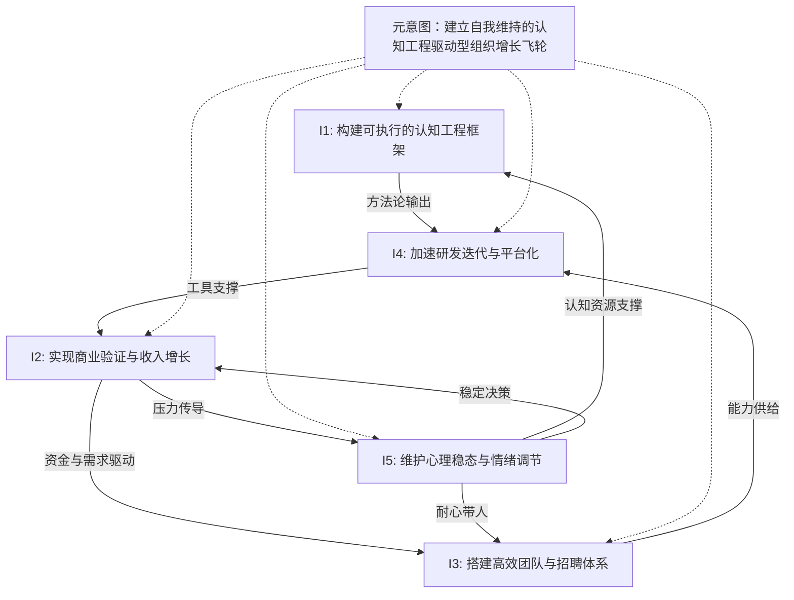

## 意图关系图



## 元意图分析

**元意图**：建立自我维持的认知工程驱动型组织增长飞轮

**说明**：五个意图并非并列关系，而是构成一个增长飞轮——

```
认知工程框架(I1) → 研发效率(I4) → 商业收入(I2) → 团队能力(I3) → 认知工程框架(I1)
                              ↕                    ↕
                         心理稳态(I5) ←—— 压力缓冲 ——— 
```

- I1 是飞轮的"引擎"——提供方法论和元规则
- I4 是"变速箱"——将方法论转化为具体生产力
- I2 是"燃料"——商业收入为整个飞轮供能
- I3 是"飞轮本身"——团队使增长可自我维持
- I5 是"减震器"——吸收商业摩擦产生的震荡，防止飞轮卡死

## 逐意图关系表

### I1：构建可执行的认知工程框架

| 关联意图 | 关系类型 | 关系说明 |
|---------|---------|---------|
| I4 | 强正向 | 认知工程框架直接输出研发方法论（范畴论→代码） |
| I5 | 弱正向 | 框架的清晰度提升（60%进度感）带来心理安全感 |
| I2 | 弱张力 | 框架投入与商业产出存在时间差，资源竞争关系 |

### I2：实现商业验证与收入增长

| 关联意图 | 关系类型 | 关系说明 |
|---------|---------|---------|
| I5 | 强耦合 | 商业进展直接驱动情绪波动，是心理压力的主要来源 |
| I3 | 强正向 | 收入增长驱动招聘和组织扩张需求 |
| I4 | 弱正向 | 商业需求明确化后为研发提供方向（需求驱动研发） |

### I3：搭建高效团队与招聘体系

| 关联意图 | 关系类型 | 关系说明 |
|---------|---------|---------|
| I4 | 强正向 | 团队能力使研发脱手成为可能 |
| I5 | 弱正向 | 团队分担工作减轻个人压力 |
| I1 | 弱正向 | 团队实践反馈可丰富认知工程框架 |

### I4：加速研发迭代与平台化

| 关联意图 | 关系类型 | 关系说明 |
|---------|---------|---------|
| I2 | 强正向 | 研发能力降低商业交付成本，提高竞争力 |
| I1 | 强正向 | 研发实践验证和反哺认知工程框架 |
| I3 | 弱正向 | 平台化减少对人工的依赖 |

### I5：维护心理稳态与情绪调节

| 关联意图 | 关系类型 | 关系说明 |
|---------|---------|---------|
| I2 | 强耦合 | 商业结果是情绪波动的主要外部因子 |
| I1 | 弱正向 | 认知清晰度提升（框架进展）缓解存在性焦虑 |
| I3 | 弱正向 | 团队支持提供情绪缓冲 |
