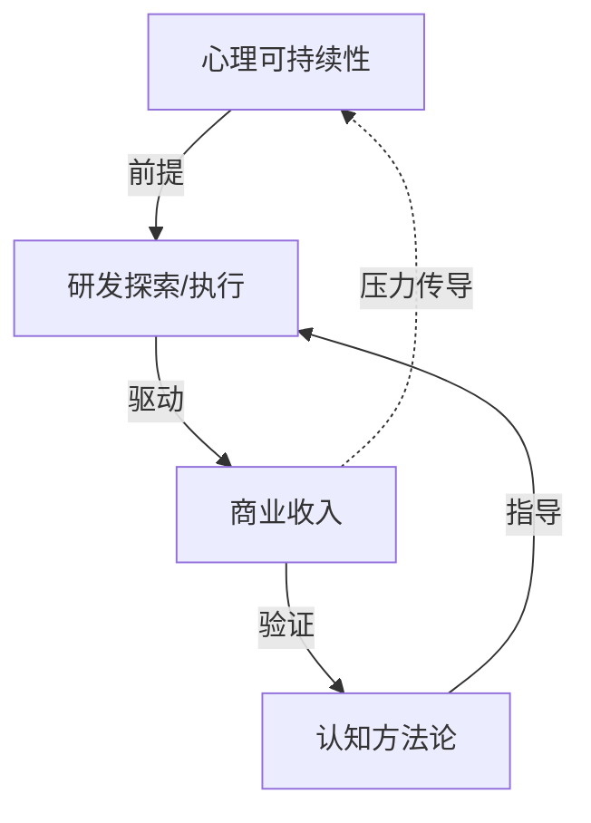

# 整合意图关系

基于 5 周（W19~W23）独立意图关系图的跨周分析，识别稳定的关系模式。

---

## 核心系统结构：创造飞轮

---

## 稳定关系对（3 周以上）

### 1. 心理可持续性 → 研发/探索

- **关系类型**：支持（基础前提）
- **出现周次**：W19, W20, W21, W22, W23（全部 5 周）
- **逻辑**：心理状态是研发执行力的先决条件。各周表述虽有不同，但"状态支撑产出"的核心逻辑贯穿始终。

### 2. 认知方法论 → 研发方法论

- **关系类型**：支持 + 互补张力
- **出现周次**：W19, W21, W22, W23（4 周）
- **逻辑**：认知/意图框架为研发/探索提供方向和收敛依据。该关系的冲突面（结构化 vs 快速试错）在 W19 和 W23 显性化。

### 3. 标准化 → 平台/基础设施

- **关系类型**：支持（底层基建）
- **出现周次**：W19, W21, W23（3 周）
- **逻辑**：标准化是平台和工具链可维护性的前提。

### 4. 认知方法论 ↔ AI 协作

- **关系类型**：双向支持
- **出现周次**：W19, W21, W23（3 周）
- **逻辑**：认知方法论指导 AI 协作设计，AI 协作反哺认知工程。

### 5. 商业动力 ⇄ 心理可持续性

- **关系类型**：冲突
- **出现周次**：W19, W20, W22（3 周）
- **逻辑**：商业活动的高压力本质与维持心理可持续性存在内在矛盾。该冲突在 5 周间经历了"隐性→显性→制度化→化解"的演化。

---

## 周期性张力

### 结构化收敛 ⇄ 快速试错

- **关系类型**：冲突
- **出现周次**：W19, W23（周期性复发）
- **逻辑**：认知/意图工程需要先理解系统的投入，探索范式要求先行动后收敛。仅在方法论迭代的关键节点显性化，在稳定期转入隐性。不是零和竞争，是需要管理的节奏——"发散(POC)→收敛(意图工程)→再发散"的循环模式。

---

## 情境性关系（1-2 周）

| 关系 | 关系类型 | 周次 | 说明 |
|------|---------|:----:|------|
| 反脆弱 ↔ 文化转型 | 冲突 | W23 | 财务离职触发的短期防御 vs 长期变革 |
| 框架投入 ↔ 商业产出 | 冲突 | W22 | 资源竞争型张力 |
| 创作 → 商业模式 | 支持 | W20, W23 | 表达方式作为商业驱动力的角色 |
| 团队建设 → 研发效率 | 支持 | W22 | 团队能力使研发脱手成为可能 |
| 虚构创作 → 状态管理 | 情感补给 | W21 | 创作提供情绪出口和创造满足感 |
