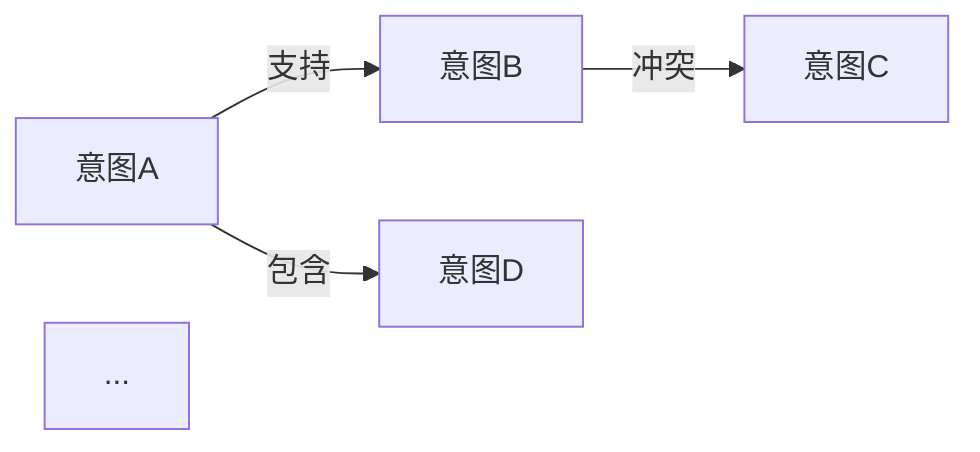

# 从念头到想法的CODE循环

基于最近一周（2026-06-01 至 2026-06-07）的默认日志，建立意图及意图关系的领域模型。

## 任务

### 1.1 话题分类

基于最近一周（2026-06-01 至 2026-06-07）的默认日志，按话题进行归类整理。

**输入**：`data/founder-journal/2026-06-01.md` ~ `2026-06-07.md`（7 篇）

**方法**：
1. 逐日阅读每篇日志，以自然段落为单位提取话题片段
2. 以"意图"为边界区分话题——同一意图导向的内容归为一个话题
3. 跨日出现的相同话题合并归类
4. 暂难归类的内容归入"其他"待后续澄清

**输出**：`outputs/task-1.1-topic-classification.md`，每个话题按以下格式交付：

```markdown
## 话题：{话题名称}

**涉及日期**：06-01, 06-03, ...

**关键段落**：
- `2026-06-01.md`：> {原文片段}
- `2026-06-03.md`：> {原文片段}

**备注**：{跨日演变、模糊点等}
```

**实际输出**：详见 `outputs/task-1.1-topic-classification.md`，共识别 9 个话题

### 1.2 意图识别

基于 task 1.1 的 9 个话题分组，在每个话题中识别核心意图。

**输入**：`outputs/task-1.1-topic-classification.md`（9 个话题，含关键段落和备注）

**方法**：
1. 对每个话题，通读其所有关键段落，提炼作者在该话题中的核心意图
2. 意图应以"为了……"或"想要……"的句式表述，明确指向行动或状态
3. 一个话题可能包含多个意图（如一个主意图+若干子意图），需标注层级关系
4. 跨话题的相同意图需合并
5. 暂无法提炼意图的话题标注"意图模糊"待后续澄清

**输出**：`outputs/task-1.2-intent-identification.md`，每个意图按以下格式交付：

```markdown
## 意图：{意图名称}

**归属话题**：{话题名称}
**清晰度**：{清晰 / 较清晰 / 模糊}

**表述**：为了…… / 想要……

**关键证据**：
- `2026-06-01.md`：> {原文片段}
- `2026-06-04.md`：> {原文片段}

**备注**：{与其他意图的关系线索、演变趋势等}
```

**实际输出**：详见 `outputs/task-1.2-intent-identification.md`（已审核通过），共识别 13 个意图

### 1.3 意图关系建模

基于 task 1.2 的 14 个意图，识别它们之间的关联关系，构建意图关系图。

**输入**：`outputs/task-1.2-intent-identification.md`（14 个意图，含归属话题、清晰度、关键证据和备注）

**方法**：
1. 遍历所有意图对，判断两两之间是否存在以下关系类型：
   - **支持（supports）**：一个意图的实现有助于另一个意图的实现
   - **冲突（conflicts）**：两个意图在方向上相互拉扯
   - **包含（contains）**：一个意图是另一个的子意图（层级关系）
   - **演进（evolves）**：一个意图在一周内演变为另一个意图
   - **依赖（depends on）**：一个意图的实现是另一个意图的前提条件
2. 以"元意图"为中心组织关系图——识别哪些意图是更根本的驱动因素
3. 标注关系强度（强/中/弱）

**输出**：`outputs/task-1.3-intent-relationship.md`（已执行），包含：
- 关系图总览（Mermaid 图）
- 按意图分类的关系详情（每个意图列出其关联意图及关系类型）
- 元意图分析（识别最核心的 2-3 个意图及其辐射范围）

```markdown
## 意图关系图



## {意图名称}

**关联意图**：

| 关系类型 | 关联意图 | 强度 | 说明 |
|---------|---------|------|------|
| 支持 | {意图B} | 强 | {为什么A支持B} |
| 冲突 | {意图C} | 中 | {A和C在什么方向上冲突} |
```
### 1.4 从 Intent 生成 Thought

每个 Intent 直接作为 1 个 Thought，不做跨意图聚合。

**输入**：`outputs/task-1.2-intent-identification.md`（13 个 Intent）

**方法**：
1. 每个 Intent 本身就是 1 个 Thought
2. 将每个 Intent 的表述直接展开为完整的 Thought 描述
3. 不添加、不组合、不分层——Intent 即 Thought

**输出**：`data/refined/thoughts.md`（已执行），13 个 Thought

---

## 实验：多轮 GraphRAG 脚手架（exp_multi）

将当前单轮对话改造为多轮，每轮累积探索状态，形成深度思考轨迹。

### 输入

- `apps/intent/src/` 当前单轮代码
- `data/formal/intent-graph.json`
- 用户入口想法（与单轮实验相同的种子）

### 方法

**核心变化：新增 DiscoveryState 跨轮累积**

```rust
struct DiscoveryState {
    explored_clusters: Vec<u32>,      // 已探索的簇 ID
    explored_node_ids: Vec<u32>,      // 已触及的图节点
    explored_edge_ids: Vec<u32>,      // 已识别的边
    open_questions: Vec<String>,      // 上一轮遗留待探索问题
    insights: Vec<String>,            // 已累积的关键洞察
}
```

**每轮流程（vs 单轮）：**

| 环节 | 单轮 | 多轮 |
|------|------|------|
| 匹配 | 仅当前输入匹配 keyword_index | 当前输入匹配 + 历史 explored_clusters 优先级提升（score × 1.5） |
| 检索 | 仅匹配簇的邻居 | 匹配簇邻居 + 历史 explored 节点的全连接子图 |
| Prompt | 图谱 + 用户输入 | 图谱 + 历史状态摘要 + 遗留问题 + 用户输入 |
| LLM 输出 | positioning + connections + exploration | 同上 + `discovery_update`（建议更新哪些簇/边/问题） |
| 状态管理 | 无 | 每次响应后合并 discovery_update，裁剪超过上限的历史 |

**Prompt 变更：**

```
你是一个基于用户个人意图图谱的思考脚手架。

## 探索历史（从第 1 轮到第 N-1 轮）

已探索簇：...
已发现连接：...
关键洞察：...
遗留问题：...

## 用户本轮想法

{input}

---

## 当前相关子图

{matched clusters + retrieved edges}

## 可用关系类型

{relation_types}

任务：生成四层回复（JSON）：
{
  "positioning": "...",
  "connections": "...",
  "exploration": "...",
  "discovery_update": {
    "new_clusters": [],
    "new_edges": [],
    "resolved_questions": [],
    "new_open_questions": [],
    "new_insights": []
  }
}
```

**状态裁剪策略**（防止 context window 膨胀）：
- explored_clusters/edges: 去重 union，最多保留 10 个簇、20 条边
- insights: 保留最近的 5 条
- open_questions: 保留 recent 3 条（上一轮已标注 resolved 的移到 resolved_questions）

**提示增强**：当同一簇连续 3+ 轮出现时，提示 LLM「已在该簇深耕，建议切换到未探索簇或做跨簇连接」。

### 输出格式

代码：`examples/exp_multi/src/`，新增 binary `exp_multi`

- `examples/exp_multi/src/lib.rs`：MultiTurnEngine（含 DiscoveryState 管理器）
- `examples/exp_multi/src/bin/exp_multi.rs`：CLI REPL

会话记录：`data/formal/sessions/session_multi.json`（格式与单轮兼容，Turn 新增 optional `discovery_update` 字段）

### 评估指标

| 指标 | 测量方式 | 与单轮对比基准 |
|------|---------|--------------|
| 新发现边/轮 | 比较相邻轮 discovery_update.new_edges | 单轮每轮新边数 |
| 探索深度 | 从入口簇出发的图距离 | 单轮平均图距离 |
| 有效利用轮次 | 连续 2 轮无新 discovery 即终止 | 单轮自然终止 |
| 连贯性 | 相邻轮 positioning 之间是否存在语义过渡 | — |
| 跨簇跳转 | 相邻轮是否探索不同簇 | 单轮每轮簇数 |

**假设**：多轮对话 + 历史累积能在第 3-4 轮达到比单轮更深的探索深度（超过 2 跳），而单轮平均停留在 1 跳邻居。

