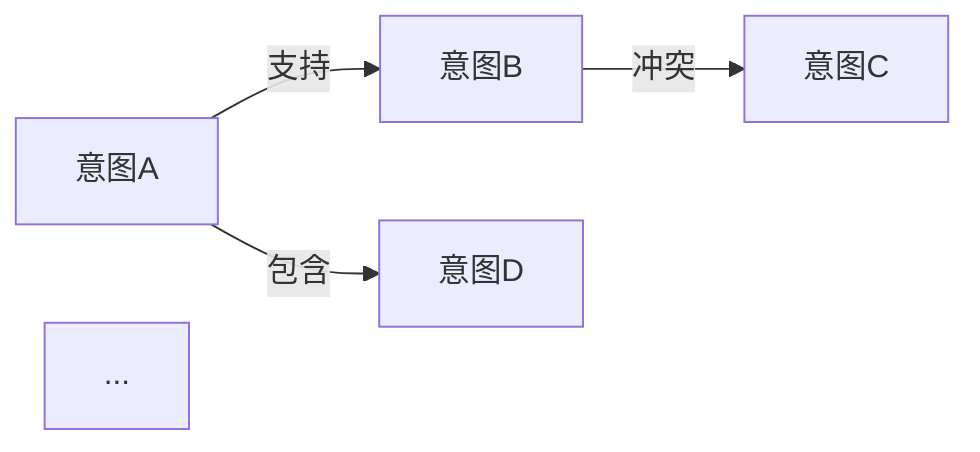

# 从念头到想法的CODE循环

基于最近一周（2026-06-01 至 2026-06-07）的默认日志，建立意图及意图关系的领域模型。

## 任务

### 1.1 话题分类

基于最近一周（2026-06-01 至 2026-06-07）的默认日志，按话题进行归类整理。

**输入**：`assets/founder-journal/2026-06-01.md` ~ `2026-06-07.md`（7 篇）

**方法**：
1. 逐日阅读每篇日志，以自然段落为单位提取话题片段
2. 以"意图"为边界区分话题——同一意图导向的内容归为一个话题
3. 跨日出现的相同话题合并归类
4. 暂难归类的内容归入"其他"待后续澄清

**输出**：`outputs/task-1.1-topic-classification.md`，每个话题按以下格式交付：

```markdown
## 话题：{话题名称}

**涉及日期**：06-01, 06-03, ...

**关键段落**：
- `2026-06-01.md`：> {原文片段}
- `2026-06-03.md`：> {原文片段}

**备注**：{跨日演变、模糊点等}
```

**实际输出**：详见 `outputs/task-1.1-topic-classification.md`，共识别 9 个话题

### 1.2 意图识别

基于 task 1.1 的 9 个话题分组，在每个话题中识别核心意图。

**输入**：`outputs/task-1.1-topic-classification.md`（9 个话题，含关键段落和备注）

**方法**：
1. 对每个话题，通读其所有关键段落，提炼作者在该话题中的核心意图
2. 意图应以"为了……"或"想要……"的句式表述，明确指向行动或状态
3. 一个话题可能包含多个意图（如一个主意图+若干子意图），需标注层级关系
4. 跨话题的相同意图需合并
5. 暂无法提炼意图的话题标注"意图模糊"待后续澄清

**输出**：`outputs/task-1.2-intent-identification.md`，每个意图按以下格式交付：

```markdown
## 意图：{意图名称}

**归属话题**：{话题名称}
**清晰度**：{清晰 / 较清晰 / 模糊}

**表述**：为了…… / 想要……

**关键证据**：
- `2026-06-01.md`：> {原文片段}
- `2026-06-04.md`：> {原文片段}

**备注**：{与其他意图的关系线索、演变趋势等}
```

**实际输出**：详见 `outputs/task-1.2-intent-identification.md`（已审核通过），共识别 13 个意图

### 1.3 意图关系建模

基于 task 1.2 的 14 个意图，识别它们之间的关联关系，构建意图关系图。

**输入**：`outputs/task-1.2-intent-identification.md`（14 个意图，含归属话题、清晰度、关键证据和备注）

**方法**：
1. 遍历所有意图对，判断两两之间是否存在以下关系类型：
   - **支持（supports）**：一个意图的实现有助于另一个意图的实现
   - **冲突（conflicts）**：两个意图在方向上相互拉扯
   - **包含（contains）**：一个意图是另一个的子意图（层级关系）
   - **演进（evolves）**：一个意图在一周内演变为另一个意图
   - **依赖（depends on）**：一个意图的实现是另一个意图的前提条件
2. 以"元意图"为中心组织关系图——识别哪些意图是更根本的驱动因素
3. 标注关系强度（强/中/弱）

**输出**：`outputs/task-1.3-intent-relationship.md`（已执行），包含：
- 关系图总览（Mermaid 图）
- 按意图分类的关系详情（每个意图列出其关联意图及关系类型）
- 元意图分析（识别最核心的 2-3 个意图及其辐射范围）

```markdown
## 意图关系图



## {意图名称}

**关联意图**：

| 关系类型 | 关联意图 | 强度 | 说明 |
|---------|---------|------|------|
| 支持 | {意图B} | 强 | {为什么A支持B} |
| 冲突 | {意图C} | 中 | {A和C在什么方向上冲突} |
```
### 1.4 从 Intent 生成 Thought

每个 Intent 直接作为 1 个 Thought，不做跨意图聚合。

**输入**：`outputs/task-1.2-intent-identification.md`（13 个 Intent）

**方法**：
1. 每个 Intent 本身就是 1 个 Thought
2. 将每个 Intent 的表述直接展开为完整的 Thought 描述
3. 不添加、不组合、不分层——Intent 即 Thought

**输出**：`outputs/task-1.4-ideas-from-intents.md`（已执行），每个 Thought 按以下格式：

```markdown
## Thought N：{Intent 名称}

**Intent**：{Intent 名称}

**Thought**：{Intent 展开为完整 Thought 的描述}
```
