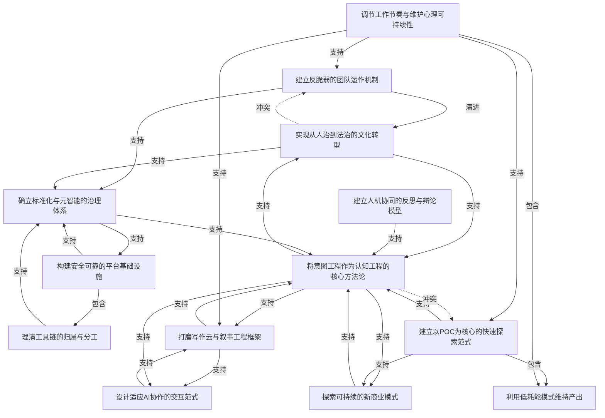

# 任务 1.3 输出：意图关系建模

## 意图关系图

---

## 元意图分析

有 3 个意图处于关系图的中心位置，辐射范围最广：

| 元意图 | 辐射范围 | 角色 |
|--------|---------|------|
| I7 将意图工程作为核心方法论 | I5, I11, I12, I2 | 理论核心——实验的核心假设 |
| I8 建立以POC为核心的快速探索范式 | I7, I9, I11 | 方法核心——一切探索的方式 |
| I13 调节工作节奏与维护心理可持续性 | I1, I8, I9, I5 | 基础核心——一切产出的前提 |

I7 和 I8 之间存在张力（结构化 vs 快速试错），但同时相互支持——POC 是发现意图的手段，意图是 POC 收敛的目标。

---

## 逐意图关系详情

### I1 建立反脆弱的团队运作机制

**关联意图**：

| 关系类型 | 关联意图 | 强度 | 说明 |
|---------|---------|------|------|
| 演进 | I2 实现从人治到法治的文化转型 | 强 | 短期反脆弱到长期文化转型是一体两面 |
| 支持 | I10 确立标准化与元智能的治理体系 | 中 | 团队反脆弱需要标准化的制度支撑 |
| 冲突 | I2 实现从人治到法治的文化转型 | 弱 | 短期稳定（反脆弱）vs 长期变革（转型） |
| 依赖 | I13 调节工作节奏与维护心理可持续性 | 强 | 管理压力越大，越需要心理调节 |

---

### I2 实现从人治到法治的文化转型

**关联意图**：

| 关系类型 | 关联意图 | 强度 | 说明 |
|---------|---------|------|------|
| 支持 | I10 确立标准化与元智能的治理体系 | 强 | 法治需要明确的标准化规则 |
| 支持 | I7 将意图工程作为核心方法论 | 中 | 意图共识可作为法治的情感底座 |
| 冲突 | I1 建立反脆弱的团队运作机制 | 弱 | 变革期的阵痛可能削弱短期韧性 |

---

### I3 构建安全可靠的平台基础设施

**关联意图**：

| 关系类型 | 关联意图 | 强度 | 说明 |
|---------|---------|------|------|
| 包含 | I4 理清工具链的归属与分工 | 强 | 工具链分工是基础设施的子问题 |
| 支持 | I10 确立标准化与元智能的治理体系 | 强 | 基础设施的可靠性依赖标准化 |

---

### I4 理清工具链的归属与分工

**关联意图**：

| 关系类型 | 关联意图 | 强度 | 说明 |
|---------|---------|------|------|
| 支持 | I10 确立标准化与元智能的治理体系 | 中 | 明确的边界是标准化的前提 |

---

### I5 打磨写作云与叙事工程框架

**关联意图**：

| 关系类型 | 关联意图 | 强度 | 说明 |
|---------|---------|------|------|
| 支持 | I12 设计适应 AI 协作的交互范式 | 强 | 写作云需要更好的交互来承载 |
| 支持 | I7 将意图工程作为核心方法论 | 中 | 叙事工程是意图工程的应用场景 |
| 依赖 | I12 设计适应 AI 协作的交互范式 | 中 | 交互范式不成熟限制写作云表达 |

---

### I6 建立人机协同的反思与辩论模型

**关联意图**：

| 关系类型 | 关联意图 | 强度 | 说明 |
|---------|---------|------|------|
| 支持 | I7 将意图工程作为核心方法论 | 强 | 辩论模型是意图发现和收敛的具体手段 |

---

### I7 将意图工程作为认知工程的核心方法论

**关联意图**：

| 关系类型 | 关联意图 | 强度 | 说明 |
|---------|---------|------|------|
| 支持 | I5 打磨写作云与叙事工程框架 | 强 | 意图工程指导叙事结构生成 |
| 支持 | I11 探索可持续的新商业模式 | 中 | 商业模式设计也是意图驱动的结构化过程 |
| 支持 | I12 设计适应 AI 协作的交互范式 | 中 | 交互范式应以用户意图为中心 |
| 支持 | I2 实现从人治到法治的文化转型 | 中 | 意图共识作为制度的心理基础 |
| 冲突 | I8 建立以 POC 为核心的快速探索范式 | 弱 | 结构化 vs 快速试错的天然张力 |
| 依赖 | I8 建立以 POC 为核心的快速探索范式 | 强 | 意图需要通过 POC 来发现和验证 |
| 依赖 | I6 建立人机协同的反思与辩论模型 | 强 | 辩论模型是意图收敛的工具 |
| 依赖 | I10 确立标准化与元智能的治理体系 | 中 | 意图表述需要标准化的框架 |

---

### I8 建立以 POC 为核心的快速探索范式

**关联意图**：

| 关系类型 | 关联意图 | 强度 | 说明 |
|---------|---------|------|------|
| 包含 | I9 利用低耗能模式维持产出 | 中 | 低耗能模式是 POC 范式在精力层面的特化 |
| 支持 | I7 将意图工程作为核心方法论 | 强 | POC 是发现和验证意图的引擎 |
| 支持 | I11 探索可持续的新商业模式 | 强 | 新商业模式本身就是商业 POC |
| 冲突 | I7 将意图工程作为核心方法论 | 弱 | 试错导向 vs 结构导向 |
| 依赖 | I13 调节工作节奏与维护心理可持续性 | 中 | 持续的 POC 需要良好精力管理 |

---

### I9 利用低耗能模式维持产出

**关联意图**：

| 关系类型 | 关联意图 | 强度 | 说明 |
|---------|---------|------|------|
| 依赖 | I13 调节工作节奏与维护心理可持续性 | 强 | 低耗能是心理调节的具体策略之一 |

---

### I10 确立标准化与元智能的治理体系

**关联意图**：

| 关系类型 | 关联意图 | 强度 | 说明 |
|---------|---------|------|------|
| 支持 | I7 将意图工程作为核心方法论 | 中 | 标准化是意图工程的基础设施 |
| 支持 | I3 构建安全可靠的平台基础设施 | 中 | 标准化支撑基础设施的可维护性 |

---

### I11 探索可持续的新商业模式

**关联意图**：

| 关系类型 | 关联意图 | 强度 | 说明 |
|---------|---------|------|------|
| 支持 | I7 将意图工程作为核心方法论 | 弱 | 商业模式设计可基于意图工程 |
| 依赖 | I8 建立以 POC 为核心的快速探索范式 | 强 | 新商业模式需要通过 POC 验证 |

---

### I12 设计适应 AI 协作的交互范式

**关联意图**：

| 关系类型 | 关联意图 | 强度 | 说明 |
|---------|---------|------|------|
| 支持 | I5 打磨写作云与叙事工程框架 | 强 | 更好的交互范式服务于创作体验 |
| 依赖 | I5 打磨写作云与叙事工程框架 | 中 | 交互需求从写作场景中涌现 |

---

### I13 调节工作节奏与维护心理可持续性

**关联意图**：

| 关系类型 | 关联意图 | 强度 | 说明 |
|---------|---------|------|------|
| 支持 | I1 建立反脆弱的团队运作机制 | 中 | 个人心理状态影响团队管理质量 |
| 支持 | I8 建立以 POC 为核心的快速探索范式 | 中 | 精力管理支撑持续探索 |
| 包含 | I9 利用低耗能模式维持产出 | 强 | 低耗能模式是心理调节的策略之一 |
| 支持 | I5 打磨写作云与叙事工程框架 | 弱 | 良好状态提升创作质量 |

---

## 关系统计

| 关系类型 | 数量 |
|---------|------|
| 支持（supports） | 25 |
| 包含（contains） | 4 |
| 演进（evolves） | 1 |
| 冲突（conflicts） | 2 |
| 依赖（depends on） | 5 |

**发现**：整个意图网络以"支持"关系为主（占 68%），冲突极少。说明这 13 个意图总体上相互促进，系统内耗小。
