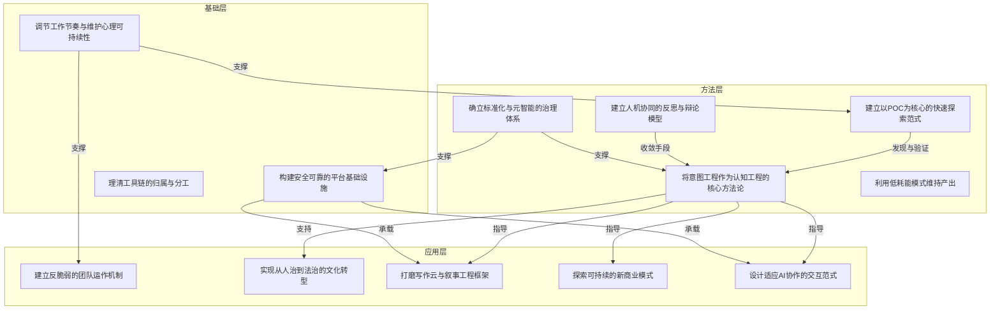

# 任务 1.4 输出：意图结构化领域模型

## 总览

---

## 分层说明

### 基础层（Foundation）

支撑一切产出的前提条件，是所有上层意图得以持续运作的底座。

| 意图 | 角色 | 为谁提供支撑 |
|------|------|-------------|
| I13 调节工作节奏与维护心理可持续性 | 精力底座 | I1, I8, I5 |
| I3 构建安全可靠的平台基础设施 | 技术底座 | I5, I12 |
| I4 理清工具链的归属与分工 | 结构底座 | I3 |

**核心逻辑**：没有心理可持续性，团队管理（I1）和持续探索（I8）都会透支；没有可靠基础设施，创作平台（I5）和交互范式（I12）无从承载。

---

### 方法层（Methodology）

定义"怎么做"的方法论意图，是基础层和应用层的桥梁。

| 意图 | 角色 | 核心输出 |
|------|------|---------|
| I7 将意图工程作为认知工程的核心方法论 | 理论核心 | 意图模型、结构框架 |
| I8 建立以 POC 为核心的快速探索范式 | 执行引擎 | 原型、验证结论 |
| I6 建立人机协同的反思与辩论模型 | 精化工具 | 收敛后的决议、章程 |
| I10 确立标准化与元智能的治理体系 | 规范框架 | 命名规范、边界定义 |
| I9 利用低耗能模式维持产出 | 节能策略 | 低认知负担的工作流 |

**核心逻辑**：I7 和 I8 构成方法层的双核心——I8 负责发散（快速试错发现意图），I7 负责收敛（建模意图形成结构）。I6 是收敛过程的加速器，I10 是收敛结果的固化剂。

---

### 应用层（Application）

方法层意图在具体领域的实践落地，是"意图包裹为想法"的最终呈现。

| 意图 | 领域 | 依赖的方法 |
|------|------|-----------|
| I5 打磨写作云与叙事工程框架 | 创作 | I7（意图工程）+ I12（交互范式） |
| I1 建立反脆弱的团队运作机制 | 组织 | I13（心理调节）+ I10（标准化） |
| I2 实现从人治到法治的文化转型 | 文化 | I7（意图工程）+ I10（标准化） |
| I11 探索可持续的新商业模式 | 商业 | I8（POC）+ I7（意图工程） |
| I12 设计适应 AI 协作的交互范式 | 体验 | I7（意图工程）+ I5（写作云） |

**核心逻辑**：5 个应用意图分别覆盖创作、组织、文化、商业、体验 5 个领域，每个应用意图都依赖于方法层的 1-2 个意图。

---

## 想法束（完整想法）

### 想法束 1：团队韧性系统

| 属性 | 内容 |
|------|------|
| **构成意图** | I1（反脆弱）+ I2（文化转型）+ I13（心理调节）+ I10（标准化） |
| **所属层** | 应用层（组织+文化）→ 方法层（标准化）→ 基础层（心理） |
| **对应问题** | 如何应对核心成员流失并完成组织升级 |

**结构化描述**：
这是一个从应急到制度化的完整路径。当团队遭遇冲击时（06-01 财务离职），先由 I13 心理调节支撑 I1 反脆弱机制稳定局势，然后 I2 文化转型将应急经验转化为制度设计，最后 I10 标准化把新制度固化为可重复的规则。I7 意图工程为 I2 提供了"以意图共识代替制度强制"的中间态方案。

**原始映射**：
- 06-01：财务离职冲击 → 反脆弱机制启动（I1）
- 06-06：人治→法治的中间态思考（I2）
- 06-04：标准化合并回元职能（I10）

---

### 想法束 2：AI 原生创作平台

| 属性 | 内容 |
|------|------|
| **构成意图** | I5（写作云）+ I12（交互范式）+ I6（辩论模型）+ I7（意图工程） |
| **所属层** | 应用层（创作+体验）→ 方法层（意图工程+辩论模型） |
| **对应问题** | 如何让 AI 真正辅助创作而非替代人类 |

**结构化描述**：
I5 写作云是核心载体，通过 I7 意图工程指导叙事结构生成（contract→content，母题/故事/风格）。I12 交互范式提供适配 AI 表达习惯的阅读器/编辑器切换体验。I6 辩论模型作为审校收敛工具，确保创作质量。三者形成"意图驱动→交互承载→辩论精化"的闭环。

**原始映射**：
- 06-02：写作云原型 + 3R（I5）
- 06-03：契约测试 → 前后端融合（I5）
- 06-06：辩论模型 + 可拓展监督（I6）
- 06-07：母题合并到故事 + 交互范式思考（I5 + I12）

---

### 想法束 3：认知工程实验方法论

| 属性 | 内容 |
|------|------|
| **构成意图** | I8（POC）+ I7（意图工程）+ I6（辩论模型）+ I9（低耗能模式） |
| **所属层** | 方法层（全部） |
| **对应问题** | 如何高效探索和收敛认知工程方法 |

**结构化描述**：
这是本实验项目自身的方法论基础。I8 POC 范式负责快速发散（大量小实验验证想法），I7 意图工程负责收敛（将实验发现结构化为模型），I6 辩论模型加速收敛过程（通过 AI 辩论精化结论），I9 低耗能模式降低执行成本（疲劳状态下依赖 AI 补全）。方法层内部形成"发散→收敛→精化"的实验循环。

**原始映射**：
- 06-01：默认日志作为 PoC 入口（I8）
- 06-03：人类洞察 + AI 补全（I8 + I9）
- 06-06：辩论模型（I6）
- 06-07：意图工程概念提出（I7）

---

### 想法束 4：平台治理体系

| 属性 | 内容 |
|------|------|
| **构成意图** | I3（基础设施）+ I4（工具链）+ I10（标准化） |
| **所属层** | 基础层（技术）+ 方法层（标准化） |
| **对应问题** | 如何管理日益复杂的技术栈和运维体系 |

**结构化描述**：
I4 理清工具链归属（code/devops/infra 的分工），I3 构建安全可靠的底层设施（备份、消息队列、本机第二大脑），I10 标准化将边界和命名规则固化（缩写统一、领域合并）。三者形成"分工→建设→固化"的治理闭环。

**原始映射**：
- 06-01：备份策略 + 双云端同步（I3）
- 06-04：RabbitMQ + 工具链归属讨论（I3 + I4）
- 06-04：缩写归总 + 标准化合并（I10）
- 06-05：命令转 Rust + 抽象哲学（I3 + I4）

---

### 想法束 5：商业创新实验室

| 属性 | 内容 |
|------|------|
| **构成意图** | I11（商业模式）+ I8（POC）+ I7（意图工程） |
| **所属层** | 应用层（商业）+ 方法层（POC + 意图工程） |
| **对应问题** | 如何在现有业务之外开辟新收入来源 |

**结构化描述**：
I8 POC 范式是商业创新的执行引擎——快速验证课程实验、代码诊断、商业孵化器等新想法。I7 意图工程负责将验证后的商业模式结构化（章程化），使其可复制。I11 是最终产出。三者形成"想法萌芽 → POC 验证 → 意图结构化"的商业创新流水线。

**原始映射**：
- 06-01：商务报价章程验证（I11 + I8）
- 06-04：课程实验 + 代码诊断 + 商业孵化器（I11）

---

## 模型统计

| 维度 | 数量 |
|------|------|
| 层数 | 3（基础层 / 方法层 / 应用层） |
| 意图总数 | 13 |
| 想法束 | 5 |
| 跨层关系 | 12 |
