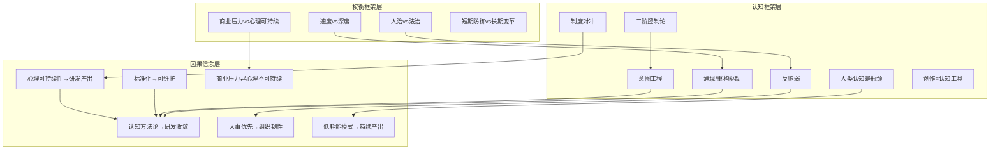

# 心智模型提炼

> 基于 2026-W19 ~ W23 跨周意图分析、固有关系分析、冲突演化分析，提取创始人底层心智模型。
> 分类：**稳定模型**(3+周出现) / **情境模型**(1-2周出现)

---

## 因果信念

| 信念 | 类型 | 涉及周次 | 证据 |
|------|------|---------|------|
| 心理可持续性 → 研发产出 | 稳定 | W19,W20,W21,W22,W23 | 稳定关系"心理可持续性→研发/探索体系"贯穿全部5周，W19 I6→I1/I8、W20 I3→I1/I2、W21 I6→I1、W22 I5→I4/I1、W23 I13→I8/I5——"状态支撑产出"是底层前提 |
| 认知方法论 → 研发收敛 | 稳定 | W19,W21,W22,W23 | 稳定关系"认知方法论→研发方法论"出现4周，认知/意图框架为研发提供方向和收敛依据，W23"意图工程"为POC范式提供收敛机制 |
| 标准化 → 可维护 | 稳定 | W19,W21,W23 | 稳定关系"标准化/治理体系→平台/基础设施"出现3周，标准化降低系统维护负担，W23"标准化合并到元职能"使其成为底层基础设施 |
| 认知方法论 ↔ AI协作 | 稳定 | W19,W21,W23 | 稳定关系"认知方法论↔AI协作"出现3周，认知方法指导AI协作设计，AI协作反哺认知工程，W23人机协同反思模型是集成产物 |
| 商业压力 ⇄ 心理不可持续 | 稳定 | W19,W20,W22 | 稳定关系"商业动力⇄心理可持续性"是唯一跨周稳定冲突对，从隐性(W19)→显性(W20)→制度化(W22)演化 |
| 人事优先 → 组织韧性 | 情境 | W22,W23 | W22"人事云"系统对抗低质量招聘，W23财务离职触发反脆弱团队设计——人才系统前置投入降低核心成员流失冲击 |
| 低耗能模式 → 持续产出 | 情境 | W23 | W23 I13"利用低耗能模式维持产出"——在疲劳状态下借助AI降低认知负担以维持产出，核心因果假设"认知负担↓=产出维持" |
| POC → 低成本验证 → 快速收敛 | 情境 | W22,W23 | W22"概念验证标准化模式"将探索成本降到极致，W23 POC范式正式确立为方法论——"先试错再规划"降低决策压力 |
| 创作 → 认知洞察 | 情境 | W20,W21,W23 | W20"小说作为默认整合入口"，W21"工作与小说的接口"发现，W23"写作云"产品化——创作是认知探索的平行通道 |

---

## 权衡框架

| 权衡 | 类型 | 涉及周次 | 证据 |
|------|------|---------|------|
| 商业压力 vs 心理可持续 | 稳定 | W19,W20,W22 | 冲突演化唯一结构性冲突(3周)，W19隐性(大单渴望vs减压需求)，W20显性爆发，W22制度化压力传导，W23通过POC+意图工程分工间接化解 |
| 速度(快速试错) vs 深度(结构化认知) | 情境 | W19,W23 | 稳定关系"认知方法论→研发方法论"中存在互补张力，W19涌现方法论vs认知工程、W23 POC范式vs意图工程——"先做再想"vs"想清楚再做"的节奏管理 |
| 人治(温度) vs 法治(制度) | 情境 | W23 | W23 I2"实现从人治到法治的文化转型"——制度化同时保留人情温度的微妙中间态，"意图共识"替代制度强制作为解法 |
| 短期防御(反脆弱/稳定) vs 长期变革(文化转型) | 情境 | W23 | 冲突演化"短期稳定↔长期变革"——财务离职触发：维护稳定vs推动变革的两难，"反脆弱团队↔文化转型"冲突 |
| 框架投入 vs 商业产出 | 情境 | W22 | 冲突演化"框架投入↔商业产出"——认知工程框架构建与商业收入的资源竞争，时间差问题 |
| 模型决定 vs 框架决定 | 情境 | W19 | W19 I7"模型决定还是框架决定"——AI协作中控制力(框架)与灵活性(模型)的选择困惑 |

---

## 认知框架

| 框架 | 类型 | 涉及周次 | 来源周次 |
|------|------|---------|---------|
| 涌现/重构驱动 | 稳定 | 全部5周 | W19"涌现方法论"(05-05"原来这就是涌现")→W20"重构是Vibe Coding第一等公民"→W21"先实验再正式开发"→W22"概念验证标准化模式"→W23"POC范式+低耗能模式" |
| 意图工程(意图=基本单元) | 稳定 | W19,W21,W22,W23 | W19二阶控制论(理论原点)→W21外化认知系统(双系统架构)→W22范畴论→代码(技术路径)→W23智谱命名"意图工程"(06-07) |
| 二阶控制论(观察者影响系统) | 稳定 | W19,W21,W22,W23 | W19智谱点醒"二阶控制论"(05-04)→W21人作为System Two观察者→W22认知工程框架→W23人机协同反思辩论(人类干预引导收敛方向) |
| 人类认知是瓶颈 | 稳定 | W20,W21,W23 | W20"人类认知是真正的瓶颈"第一性原理(05-17)→W21"唯一的瓶颈就是我的精力"(05-23)→W23低耗能模式(AI降低认知负担维持产出) |
| 创作=认知工具 | 稳定 | W20,W21,W23 | W20"小说作为默认整合入口"(05-16)→W21"工作与小说的接口"发现(05-21)→W23"写作云"产品框架(3R方法论) |
| 反脆弱(冲击=锻炼机会) | 情境 | W19,W23 | W19"把阻碍本身变成养料"(05-04，萌芽)→W23"反脆弱的团队运作机制"(06-01，显性化)——从个人韧性到组织反脆弱的升维 |
| 制度对冲(用系统设计替代硬扛) | 情境 | W22,W23 | W22"用冰冷的制度转移压力"(05-30)→W23"法治替代人治"(06-06)——从被动情绪调节到主动系统设计的认知跃迁 |
| 商业压力转化(压力=产品需求) | 情境 | W20,W22,W23 | W20"营收压力是增长问题"(05-13)→W22"取舍哲学+多客户对冲"(05-29)→W23"商业模式POC"(06-04)——压力被重新定义为信号 |
| 自我标准化(系统获得元能力) | 情境 | W20,W23 | W20"自我标准化"元概念浮现(05-14)→W23"标准化合并到元职能"(06-04)——系统从被设计获得自我设计能力 |
| 低耗能模式 | 情境 | W23 | W23"在疲劳状态下AI维持产出"(06-03)——将脆弱状态转化为可管理的设计模式 |

---

## 心智模型升级路径

| 时间点 | 旧模型 | 新模型 | 触发因素 |
|--------|--------|--------|---------|
| W19→W20 | 涌现哲学(直觉驱动、追求表达速度中的涌现) | 重构循环(工程化："探索→重构→收敛→产出"标准化循环) | 05-12实战发现"开发和重构应是1:1工作量"，"重构要尽早" |
| W19→W20 | 每人配一个秘书(朴素AI助手观) | 双引擎架构(Opencode执行层+Zed Agent评审层) | 05-17确立"人类认知是瓶颈"第一性原理 |
| W20→W21 | 个人重构循环(人肉驱动的工程方法) | 工具链标准化落地(Python→Rust CLI工具链自动化) | 05-20进入生产级研发阶段，Rust强类型优于Python的发现 |
| W21→W22 | 外化认知系统(System Two+System One哲学架构) | 范畴论→元引→代码(可执行技术路径) | 05-26范畴论建模直接生成代码实验成功 |
| W22→W23 | 概念验证模式(探索标准化的实操方法) | POC范式+低耗能模式(普适方法论双引擎) | 06-01默认日志作为POC输入实验成功 |
| W22→W23 | 制度对冲(被动防御："冰冷制度转移压力") | 反脆弱设计(主动韧性：建立组织层面的抗冲击机制) | 06-01财务离职触发反脆弱实验 |
| W19→W23 | 二阶控制论(哲学原点、智谱点醒的外部框架) | 意图工程(自主命名的方法论：意图=基本单元) | 06-07智谱提出"意图工程"概念使5周探索获得归属 |
| W20→W23 | 标准化填坑("标准化是一个填坑"，被动补短板) | 标准化元职能(主动治理：合并冗余、统一命名、自我标准化) | 系统复杂度达到临界点——多领域冗余、缩写混乱 |
| W19(W20)→W23 | 商业vs心理零和博弈(个人层面的资源争夺) | POC+意图工程正和循环(组织层面的互补分工) | 意图工程方法论成熟——发散(POC)→收敛(意图工程)→再发散的循环设计完成 |

---

## 心智模型图谱

---

## 汇总统计

| 类别 | 稳定模型 | 情境模型 | 合计 |
|------|---------|---------|------|
| 因果信念 | 5 | 4 | 9 |
| 权衡框架 | 1 | 5 | 6 |
| 认知框架 | 5 | 5 | 10 |
| **合计** | **11** | **14** | **25** |

**核心发现**：
1. **最底层信念**："心理可持续性→研发产出"是唯一贯穿全部5周、涉及所有其他模型的根信念
2. **最大升级节点**：W19→W23的"二阶控制论→意图工程"命名升华是5周最大的心智模型跃迁
3. **关键触发**：06-01财务离职事件一次性触发3个模型升级(反脆弱设计、制度→法治、POC加速验证)
4. **化解路径**：商业vs心理的零和博弈通过POC+意图工程分工转化为正和循环，是最重要的冲突化解模式
